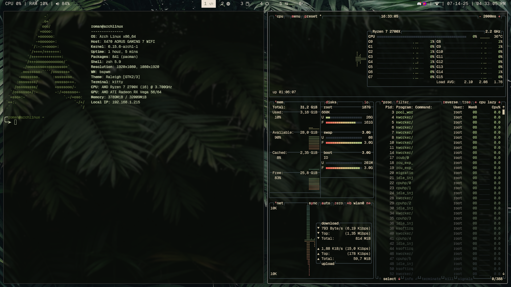
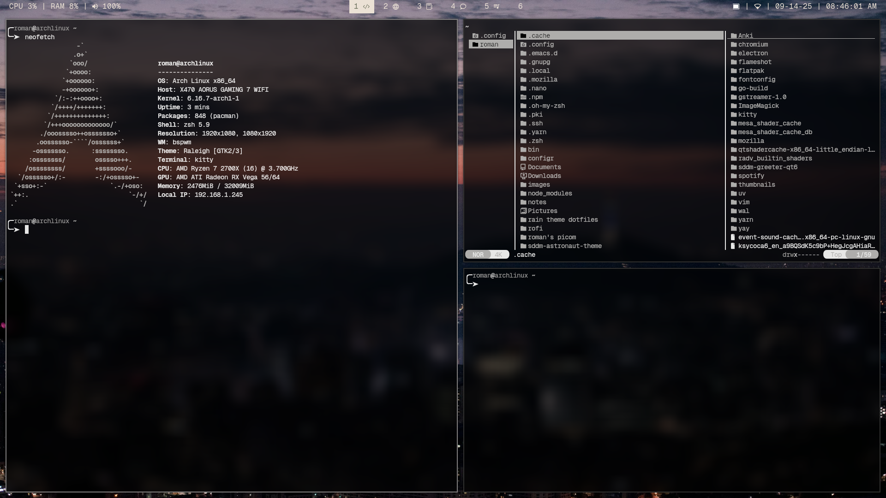
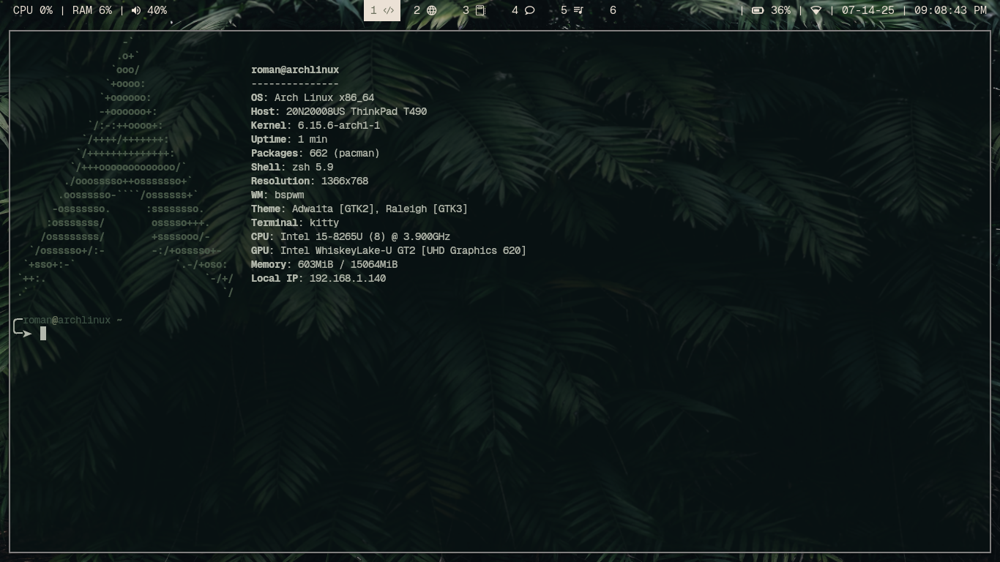

# Roman's Rice + Dot files (With Install Script)




  <details>
  <summary>Laptop Post-Install</summary>

  

  </details>


A lightweight, minimalist Linux environment built for speed, automation, and dynamic theming. Originally developed to migrate my DE/WM to my ThinkPad T490, this setup is now optimized for use across multiple devices.

**NOTE:** This setup and install script assume an Arch-based system (e.g. `pacman`, `yay`, Arch file structure).  
If you're using another distribution you <u>*will*</u> need to tweak accordingly.

## Dependencies

The install script will automate these via `pacman` and AUR.

| Package         | Purpose                                       |
|------------------|-----------------------------------------------|
| `bspwm`          | Tiling window manager                         |
| `sxhkd`          | Hotkey daemon to control bspwm                |
| `picom`          | Compositor for transparency and animations    |
| `polybar`        | Custom status bar                             |
| `rofi`           | Application launcher (with dynamic theming)   |
| `dunst`          | Lightweight notification daemon               |
| `pywal`          | Generates color schemes from wallpaper        |
| `brightnessctl`  | Controls screen brightness via hotkeys        |
| `pamixer`        | CLI audio control (volume/mute, used in bar)  |
| `ttf-geist` + `ttf-geist-mono` | Primary UI + terminal fonts     |

</div>
</details>


## 💻 Installation  

<details>
  <summary><strong> Install Using Script </strong></summary>

### Requirements:

- You’ve already installed a clean copy of Arch Linux.
- You have a working internet connection and user account.
- You’re logged in as a regular user (not `root`).
- `git`, `curl`, and `sudo` are available.
- Your device uses UEFI and you’ve installed a bootloader.

### Installation Steps

1. Install Git:

```bash
» sudo pacman -S git
```
2. Clone this repository
```bash
» git clone https://github.com/x
```
3. Run the Installer
```bash
» cd ~/.dotfiles
» chmod +x install.sh
» ./install.sh
```
This script installs all dependencies, sets up dotfiles, fonts, pywal, SDDM, and reboots into your new environment.  
  
</details>

<details> 
  <summary><strong>Manually Clone Repository</strong></summary>  
‎ 

1. Clone the repository:
```bash
~ » git clone https://github.com/roman-xo/new.git ~/.dotfiles
```

2. Remove README:
```bash
~ » rm README.md
~ » config update-index --assume-unchanged README.md
```
</details>

## 📝 Notes

- This setup is built with **SDDM** in mind as the display/login manager.

- You can enable window animations with `picom`, simply add the following line in `~/.config/picom/picom.conf`:

```bash
  @include "picom-animations.conf"
  ```
- To change your color scheme at any time, just run:
```bash
  wal -i <path-to-image>
  ```
- You can use nitrogen or feh to manually change the wallpaper or adjust if needed.
