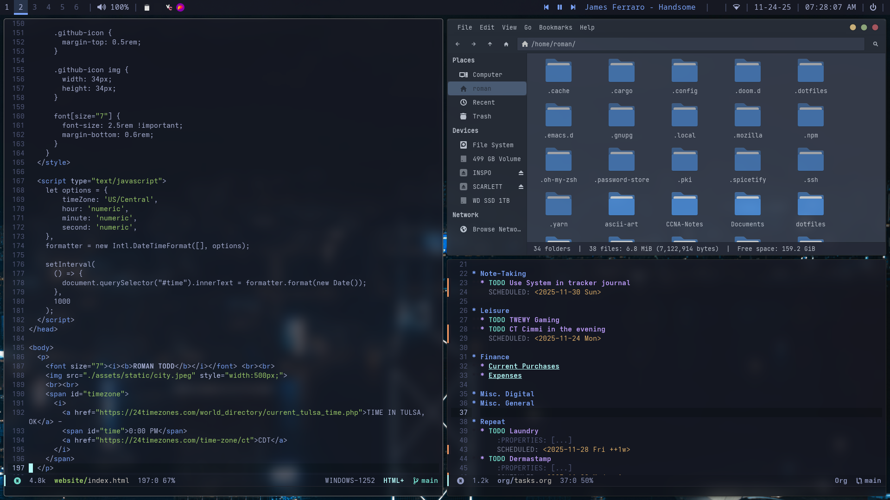
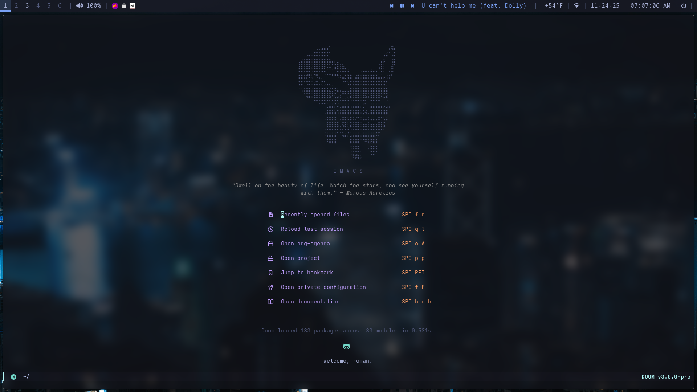

# Roman's BSPWM Rice / DotFiles

https://github.com/user-attachments/assets/fcb1e2b1-36db-456f-a35e-fedbcfc15655




  <details>
  <summary>Laptop Post-Install</summary>

  

  </details>


**NOTE:** This setup and install script assumes an Arch-based system.  
If you're using another distribution you <u>*will*</u> need to tweak accordingly. There are also configurations that are hard-coded, so some additional tweaking will be needed after using the script

## Dependencies

The install script will automate these via pacman and AUR.

| Package         | Purpose                                       |
|------------------|-----------------------------------------------|
|  bspwm           | Tiling window manager                         |
|  sxhkd           | Hotkey daemon to control bspwm                |
|  picom           | Compositor for transparency and animations    |
|  polybar         | Custom status bar                             |
|  rofi            | Application launcher (with dynamic theming)   |
|  dunst           | Lightweight notification daemon               |
|  pywal           | Generates color schemes from wallpaper        |
|  brightnessctl   | Controls screen brightness via hotkeys        |
|  pamixer         | CLI audio control (volume/mute, used in bar)  |
|  ttf-geist + ttf-geist-mono    | Primary UI + terminal fonts     |

</div>
</details>


## Installation  

<details closed>
  <summary><strong> Install Using Script </strong></summary>

### Requirements:

- You’ve already installed a clean copy of Arch Linux.
- You have a working internet connection and user account.
- You’re logged in as a regular user (not `root`).
- `git`, `curl`, and `sudo` are available.
- Your device uses UEFI and you’ve installed a bootloader.

### Installation Steps

1. Install Git:

```bash
~ » sudo pacman -S git
```
2. Clone this repository
```bash
~ » git clone https://github.com/roman-xo/dotfiles
```
3. Run the Installer
```bash
~ » cd ~/dotfiles
~ » chmod +X install.sh
~ » ./install.sh
```
This script installs all dependencies, sets up dotfiles, fonts, pywal, SDDM, and reboots into your new environment.  
  
</details>

<details> 
  <summary><strong>Manually Clone Repository</strong></summary>  
‎ 
<div style="padding-top: 5px;">
1. Clone the repository:
```bash
~ » git clone https://github.com/roman-xo/dotfiles
```

2. Remove README:
```bash
~ » rm README.md
~ » config update-index --assume-unchanged README.md
```
</details>

## Notes

- You can enable window animations with picom, simply add the following line in ` ~/.config/picom/picom.conf `:

```bash
  @include "picom-animations.conf"
  ```
- To change your color scheme at any time, just run:
```bash
  wal -i <path-to-image>
  ```
- You can use nitrogen or feh to manually change the wallpaper or adjust if needed.
